# NEXUS

> **NEXUS — Agentic Business Intelligence Platform**  
> *Where Business Data Becomes Intelligence.*

[](https://github.com/rzvn6660/Nexus/actions/workflows/ci.yml)
[](https://fastapi.tiangolo.com)
[](https://www.sqlalchemy.org/)
[](https://www.postgresql.org/)
[](https://react.dev)
[](https://www.typescriptlang.org/)
[](LICENSE)

---

## 1. What is NEXUS?

**NEXUS** is an enterprise-grade agentic business intelligence platform built from the ground up for serious analytical decision-making. 

NEXUS is **not** another toy "chat with CSV" application that passes unvetted prompt strings to a Large Language Model and hopes the calculations are correct. Instead, NEXUS enforces a strict **hybrid intelligence architecture**:
- **Deterministic Computational Precision**: Pure mathematical operations, SQL aggregations, descriptive statistics, variance breakdowns, and time-series forecasting are performed exclusively by Python scientific libraries (`Pandas`, `NumPy`, `SciPy`, `scikit-learn`) and relational database engines (`PostgreSQL`).
- **Stateful Agent Reasoning**: Complex intent parsing, task decomposition, iterative root-cause investigation, and executive narrative synthesis are orchestrated through stateful `LangGraph` workflows.
- **Evidence & Semantic Verification**: Every insight must cite an auditable proof packet including the exact SQL query executed, dataset row counts, timestamp ranges, and confidence intervals.

---

## 2. The Problem NEXUS Solves

Traditional business intelligence suffers from a persistent structural disconnect:
1. **Traditional Dashboards are Static & Silent**: BI dashboards show *what* happened, but they cannot explain *why* it happened or *what to do next*. Business users must constantly queue requests to data analysts.
2. **Generic LLM Chatbots Hallucinate Math**: Standard conversational AI chatbots make basic mathematical errors, hallucinate figures, invent definitions of revenue, and cannot prove the lineage of their claims.
3. **Analyst Burnout**: Professional analysts spend 80% of their working hours answering repetitive ad-hoc metric questions, pulling basic CSV slices, and writing standard SQL queries rather than driving high-value strategy.

NEXUS bridges this divide by acting as a **trustworthy, deterministic analytical copilot**.

---

## 3. Why Augment Analysts Instead of Replacing Them?

Enterprise analysis is not purely a computational problem—it requires tacit domain knowledge, regulatory compliance, corporate policy awareness, and strategic judgment. 

NEXUS is designed around an **Augmentation-First Doctrine**:
- Automates data wrangling, data quality validation, initial anomaly scanning, and deterministic variance calculations.
- Prepares structured **Evidence Packets** and draft recommendations with clear assumptions.
- Requires **Human-in-the-Loop (HITL) review** for all strategic decisions, allowing analysts and executives to approve, refine, or reject findings with domain-specific feedback.

---

## 4. The 11-Step Closed-Loop Workflow

Every analytical query traverses an auditable 11-step pipeline:

```mermaid
flowchart LR
    Data["1. Data"] --> Understand["2. Understand"]
    Understand --> Check["3. Check"]
    Check --> Analyze["4. Analyze"]
    Analyze --> Investigate["5. Investigate"]
    Investigate --> Validate["6. Validate"]
    Validate --> Explain["7. Explain"]
    Explain --> Predict["8. Predict"]
    Predict --> Recommend["9. Recommend"]
    Recommend --> Human["10. Human Decision"]
    Human --> Measure["11. Measure Outcome"]
```



| Step | Engine Type | Core Responsibility |
| :--- | :--- | :--- |
| **1. Data** | Deterministic | Connect to and ingest verified operational tables (sales, customers, products, inventory, expenses). |
| **2. Understand** | Hybrid | NLU resolves natural-language user queries into explicit metric dimensions and time slices. |
| **3. Check** | Deterministic | Profiles datasets for null rates, schema integrity, and fresh transaction timestamps. |
| **4. Analyze** | Deterministic | Executes exact SQL queries and statistical computations (zero LLM math). |
| **5. Investigate** | Hybrid | Decomposes variances into volume, price, and mix shift anomalies across sub-dimensions. |
| **6. Validate** | Deterministic | Cross-references claims against executed query outputs, statistical significance, and error bands. |
| **7. Explain** | Hybrid | Translates computational proof tables into concise, executive-grade business narratives. |
| **8. Predict** | Deterministic | Extrapolates short-term demand trends and stockout horizons with explicit confidence intervals. |
| **9. Recommend** | Hybrid | Generates actionable operational interventions (e.g. reorder thresholds, clearance schedules). |
| **10. Human Decision** | Human Gate | Presents evidence and assumptions to human analysts for review, adjustment, or sign-off. |
| **11. Measure Outcome**| Deterministic | Closed-loop tracking of actual post-decision metrics vs. predicted baselines. |

---

## 5. System Architecture

```
nexus/
│
├── backend/
│   ├── app/
│   │   ├── api/             # FastAPI versioned endpoints (/api/health, /api/v1)
│   │   ├── core/            # Config (Pydantic v2), Database (SQLAlchemy 2.x), Logging, Middleware
│   │   ├── models/          # Declarative ORM models & audit mixins
│   │   ├── schemas/         # Pydantic validation & response schemas
│   │   ├── services/        # Business logic services
│   │   ├── agents/          # LangGraph graph, nodes, deterministic tools, state (Phase 3)
│   │   ├── analytics/       # Descriptive, diagnostic, predictive, and statistical engines (Phase 2)
│   │   ├── data/            # Ingestion, profiling, quality rules, external connectors
│   │   ├── rag/             # Organizational memory, vector store, embeddings, semantic layer
│   │   ├── knowledge/       # Retail domain taxonomy & static ontologies
│   │   ├── evaluation/      # Benchmark harnesses, accuracy scorecards, automated graders
│   │   ├── security/        # Query sanitization, rate limits, execution guardrails
│   │   └── observability/   # Tracing, structured logs, request correlation IDs
│   ├── alembic/             # Database migrations
│   ├── tests/               # Pytest test suite
│   └── Dockerfile           # Backend containerization
│
├── frontend/
│   ├── src/                 # React 18, TypeScript, Vite, Tailwind CSS SPA
│   │   ├── components/      # Modular UI components (Health card, Workflow visualizer, Architecture grid)
│   │   ├── services/        # API client and backend communication
│   │   └── types/           # Strong TypeScript interfaces
│   └── Dockerfile           # Frontend multi-stage containerization
│
├── data/
│   ├── sample/              # Sample retail datasets for local prototyping
│   └── synthetic/           # Synthesized scenario datasets for evaluation
│
├── evaluation/              # Benchmark datasets, golden test questions, and graders
├── docs/                    # Architectural blueprints and component specifications
├── infra/                   # Docker Compose and deployment configurations
├── scripts/                 # Dev environment setup and database initialization scripts
├── docker-compose.yml       # PostgreSQL, Backend, and Frontend orchestration
└── pyproject.toml           # Root project definitions and tool configurations
```

---

## 6. Technology Stack

- **Backend**: Python 3.12+, FastAPI, Pydantic v2, SQLAlchemy 2.x, Alembic, Pytest
- **Database**: PostgreSQL 16 (relational data, future pgvector support)
- **Deterministic Analytics (Phase 2)**: Pandas, NumPy, SciPy, scikit-learn
- **AI & Agent Orchestrator (Phase 3)**: LangGraph, LangChain, Structured Outputs
- **Frontend**: React 18, TypeScript, Vite, Tailwind CSS, Lucide Icons
- **Infrastructure**: Docker, Docker Compose, GitHub Actions CI
- **Observability**: Structured JSON logging, Request Correlation (`X-Request-ID`), Latency tracking

---

## 7. Current Project Status

| Layer | Status | Implemented Functionality |
| :--- | :---: | :--- |
| **Backend Core** | **Implemented** | FastAPI application factory, Pydantic v2 settings, SQLAlchemy 2.x engine pooling, Alembic migration foundation, correlation ID middleware, structured logging |
| **Health API** | **Implemented** | `GET /api/health` providing service telemetry, runtime version, environment, and non-blocking database ping |
| **API Versioning** | **Implemented** | `/api/v1` router namespace with modular endpoint isolation |
| **Docker Compose** | **Implemented** | Multi-service Compose environment orchestrating PostgreSQL 16, backend, and frontend |
| **Frontend Foundation** | **Implemented** | React 18 + Vite + Tailwind CSS dashboard visualizing live telemetry, 11-step workflow, and domain entities |
| **Test Suite** | **Implemented** | Pytest test suite covering health endpoints, settings defaults, and DB disconnection fallbacks |
| **Documentation** | **Implemented** | System architecture, backend architecture, agent topology, analytics taxonomy, semantic layer, evidence packets, HITL workflow |
| **CI Automation** | **Implemented** | GitHub Actions workflow executing backend tests, type checks, and frontend build |
| **Retail Data Schemas** | *Planned (Phase 2)* | Schema definitions and seeds for Sales, Customers, Products, Inventory, and Expenses |
| **Deterministic Analytics** | *Planned (Phase 2)* | Descriptive KPI calculations, variance decomposition, and forecasting modules |
| **LangGraph Agents** | *Planned (Phase 3)* | Multi-node state machine and tool calling routines |
| **Semantic Layer** | *Planned (Phase 3)* | Explicit metric catalog and formula compiler |
| **Evidence & HITL** | *Future (Phase 4)* | Cryptographic evidence hashing and analyst approval console |

---

## 8. Local Setup & Quickstart

### Prerequisites
- **Python 3.12+**
- **Node.js 20+** and **npm**
- **Docker & Docker Compose** (optional for local non-Docker development)

### 1. Clone & Configure Environment
```bash
git clone https://github.com/rzvn6660/Nexus.git
cd nexus

# Create your local environment file
cp .env.example .env
```

### 2. Option A: Run with Docker Compose (Recommended)
```bash
docker compose up -d
```
- Frontend: http://localhost:3000
- Backend API: http://localhost:8000
- OpenAPI Docs: http://localhost:8000/docs
- Health Check: http://localhost:8000/api/health

### 3. Option B: Run Locally Without Docker

#### Terminal 1 — Backend
```bash
# Set up Python virtual environment
cd backend
python -m venv .venv

# On Linux/macOS:
source .venv/bin/activate
# On Windows:
.venv\Scripts\activate

# Install dependencies
pip install -r requirements-dev.txt

# Start backend server
uvicorn app.main:app --reload --host 0.0.0.0 --port 8000
```

#### Terminal 2 — Frontend
```bash
cd frontend
npm install
npm run dev
```

---

## 9. Running Tests

### Backend Tests
```bash
cd backend
pytest
```
All tests run with verbose output and validate root metadata, health contracts, settings parsing, and database fallback behavior.

### Frontend Validation
```bash
cd frontend
npm run type-check
npm run build
```

---

## 10. Architectural Documentation Index

For in-depth architectural specifications, see the `/docs/architecture/` directory:
- [System Architecture](file:///docs/architecture/system_architecture.md)
- [Backend Architecture](file:///docs/architecture/backend_architecture.md)
- [Agent Architecture & State Machine](file:///docs/architecture/agent_architecture.md)
- [Deterministic Analytics Engine](file:///docs/architecture/analytics_architecture.md)
- [RAG & Organizational Memory](file:///docs/architecture/rag_architecture.md)
- [Semantic Layer & Explicit Metrics](file:///docs/architecture/semantic_layer.md)
- [Evidence & Validation Framework](file:///docs/architecture/evidence_validation.md)
- [Human-in-the-Loop Workflow](file:///docs/architecture/human_in_the_loop.md)

---

## 11. Project Roadmap

- [x] **Phase 1: Foundation (Current)**
  - Repository structure, FastAPI backend, SQLAlchemy 2.x, Alembic, Docker Compose, React frontend, health endpoints, test runner, comprehensive architecture docs, CI pipeline.
- [ ] **Phase 2: Retail Data Domain & Deterministic Analytics Engine**
  - Small retail/distribution schema (sales, customers, products, inventory, expenses), data ingestion, profiling, descriptive KPIs, variance decomposition, demand forecasting.
- [ ] **Phase 3: Stateful Agent Orchestration & Semantic Layer**
  - LangGraph workflow integration, explicit metric catalog, hybrid business context retrieval (RAG), tool calling guardrails.
- [ ] **Phase 4: Evidence Engine & Human-in-the-Loop Console**
  - Traceable query hashing, proof slices, assumption tracking, analyst review interface, closed-loop outcome measurement.
- [ ] **Phase 5: Enterprise Scaling & Multi-Tenancy**
  - Tenant isolation, role-based access control (RBAC), multi-branch retail distribution support, production deployment manifests.

---

## 12. License
Apache License 2.0. Copyright (c) 2026 NEXUS Team.
