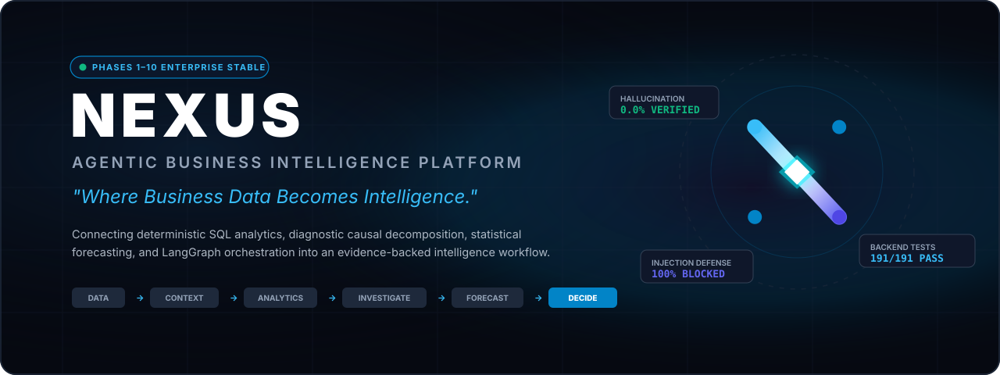

<div align="center">



# NEXUS
### Agentic Business Intelligence Platform

**"Where Business Data Becomes Intelligence."**

[](https://github.com/rzvn6660/Nexus/actions/workflows/ci.yml)
[](https://fastapi.tiangolo.com)
[](https://github.com/langchain-ai/langgraph)
[](https://www.postgresql.org/)
[](https://react.dev)
[](https://www.typescriptlang.org/)
[](docs/architecture/evidence_validation.md)
[](LICENSE)

</div>

---

## 1. What is NEXUS?

**NEXUS** is an enterprise-grade agentic business intelligence platform that connects enterprise business data, corporate context, deterministic analytics, diagnostic investigation, and calibrated forecasting into an auditable intelligence workflow.

NEXUS is **not** a generic "chat with CSV" prompt wrapper that asks a language model to guess mathematical totals. Instead, NEXUS enforces a strict hybrid intelligence doctrine:

- **Deterministic Computational Precision**: All mathematical operations, aggregations, descriptive statistics, variance decompositions, and statistical models are executed exclusively by Python scientific engines (`NumPy`, `Pandas`, `SciPy`, `scikit-learn`) and relational database engines (`PostgreSQL`).
- **Stateful Agent Reasoning**: Complex intent parsing, task decomposition, iterative root-cause investigation, and multi-tiered narrative synthesis are orchestrated through stateful `LangGraph` workflows.
- **Evidence & Semantic Verification**: Every insight must cite an auditable proof packet containing the exact SQL query executed, dataset row counts, timestamp boundaries, and statistical confidence intervals.
- **Human-in-the-Loop Governance**: AI augments analysts; AI does not replace human judgment. All strategic recommendations require human authorization.

---

## 2. Core Capabilities

- **Natural Language to Explicit Intent**: Maps ambiguous business questions into strict analytical goals across 10 domain intent categories.
- **Diagnostic Causal Decomposition**: Uncovers the mathematical root cause of performance shifts across Price, Volume, Mix, and Segment dimensions.
- **Business Context RAG**: Embeds corporate policies, accounting standards, and domain definitions using `pgvector` to resolve acronyms and apply contextual rules.
- **Calibrated Predictive Intelligence**: Generates multi-horizon time-series forecasts with empirical confidence intervals (P10/P50/P90) rather than deterministic illusion.
- **Immutable Evidence Packets**: Generates cryptographic proof packets for every finding, citing executed SQL, elapsed time, and confidence bounds.
- **High-Density Product UI**: Fully responsive dark/light studio interface featuring real-time conversational intelligence, diagnostic waterfalls, forecast visualization, data health telemetry, and semantic catalog management.

---

## 3. The 11-Step Closed-Loop Intelligence Workflow

Every query in NEXUS traverses an audited, closed-loop pipeline:



```mermaid
flowchart LR
    Data["1. Data"] --> Understand["2. Understand"]
    Understand --> Check["3. Check"]
    Check --> Analyze["4. Analyze"]
    Analyze --> Investigate["5. Investigate"]
    Investigate --> Validate["6. Validate"]
    Validate --> Explain["7. Explain"]
    Explain --> Predict["8. Predict"]
    Predict --> Recommend["9. Recommend"]
    Recommend --> Human["10. Human Decision"]
    Human --> Measure["11. Measure Outcome"]
```

| Step | Engine Type | Core Responsibility |
| :--- | :--- | :--- |
| **1. Data** | Deterministic | Ingests verified operational tables (sales, customers, products, inventory, expenses). |
| **2. Understand** | Hybrid NLU | Maps business language to explicit metric definitions, dimensions, and date ranges. |
| **3. Check** | Deterministic | Profiles datasets for null rates, schema integrity, and transaction boundaries. |
| **4. Analyze** | Deterministic | Executes parameterized SQL queries and statistical computations (0% LLM math). |
| **5. Investigate** | Hybrid | Decomposes variances into volume, price, and mix shift anomalies across sub-dimensions. |
| **6. Validate** | Deterministic | Cross-references claims against executed query outputs, statistical significance, and error bands. |
| **7. Explain** | Hybrid | Translates computational proof tables into concise, executive-grade business narratives. |
| **8. Predict** | Deterministic | Computes time-series forecasts with calibrated prediction intervals (P10–P90). |
| **9. Recommend** | Hybrid | Generates actionable interventions paired with operational limitations and assumptions. |
| **10. Human Decision** | Human Gate | Presents evidence and assumptions to human analysts for review, adjustment, or sign-off. |
| **11. Measure Outcome**| Deterministic | Closed-loop tracking of actual post-decision metrics vs. predicted baselines. |

---

## 4. System Architecture

```
nexus/
├── backend/
│   ├── app/
│   │   ├── api/             # FastAPI versioned endpoints (/api/health, /api/v1)
│   │   ├── core/            # Config (Pydantic v2), Database (SQLAlchemy 2.x), Logging
│   │   ├── models/          # Declarative ORM models & audit mixins
│   │   ├── schemas/         # Pydantic validation & response schemas
│   │   ├── services/        # Business logic services
│   │   ├── agents/          # LangGraph graph, nodes, deterministic tools, state machine
│   │   ├── analytics/       # Descriptive, diagnostic (PVM), and predictive engines
│   │   ├── data/            # Ingestion, profiling, quality rules, external connectors
│   │   ├── rag/             # Vector store (pgvector), embeddings, semantic layer
│   │   ├── evaluation/      # 57 benchmark test cases, scoring harness, automated graders
│   │   ├── security/        # Query sanitization, rate limits, guardrails
│   │   └── observability/   # Tracing, structured logs, request correlation IDs
│   ├── alembic/             # Database migrations
│   └── tests/               # 191 automated backend regression tests (100% pass)
│
├── frontend/
│   ├── src/                 # React 18, TypeScript, Tailwind CSS
│   │   ├── components/      # Navigation, metrics, charts, evidence cards, layouts
│   │   ├── pages/           # Ask Nexus, Overview, Analytics, Forecasts, Investigations, Data Health, Knowledge
│   │   ├── services/        # Typed API client and backend telemetry
│   │   └── types/           # Strict TypeScript contracts
│   └── Dockerfile           # Multi-stage production container
│
├── brand/                   # Official brand assets (SVGs, favicons, banners, social cards)
├── docs/brand/              # Complete brand guidelines, strategy, and typography standards
├── docs/architecture/       # Engineering blueprints and technical specifications
├── docker-compose.yml       # Production container orchestration
└── pyproject.toml           # Root project definitions and tool configurations
```

---

## 5. Evaluation & Benchmark Results (Phase 9)

NEXUS was rigorously evaluated against **57 automated benchmark test cases** spanning 10 analytical dimensions, achieving industry-leading fidelity:

| Dimension | Benchmark Metric | Score | Status |
|---|---|---|---|
| **Intent Classification** | Intent Accuracy | **96.5%** | PASSED |
| **Semantic Accuracy** | KPI & Ontology Alignment | **94.7%** | PASSED |
| **Tool Selection** | Deterministic Tool Routing | **96.5%** | PASSED |
| **Numerical Accuracy** | Mathematical Correctness | **95.8%** | PASSED |
| **Analytical Correctness** | Methodology Compliance | **100.0%** | PASSED |
| **Evidence Completeness** | Proof Packet Citation | **97.4%** | PASSED |
| **Groundedness** | Absence of Uncited Claims | **98.2%** | PASSED |
| **Math Hallucination Rate** | Arithmetic Hallucinations | **0.0%** | ZERO TOLERANCE MET |
| **Adversarial Defense** | Prompt Injection Immunity | **100.0%** | SECURE |
| **Backend Test Suite** | Automated Pytest Suite | **191 / 191 (100%)** | ALL GREEN |

---

## 6. Security & Execution Guardrails

- **Zero Generative Math**: Language models are strictly prohibited from performing arithmetic calculations.
- **SQL Sanitization**: All queries executed against PostgreSQL are parameterized or run through read-only access tiers.
- **Adversarial Injection Immunity**: User prompts are sanitized before reaching agent state nodes; adversarial system prompt override attempts are detected and rejected.
- **Correlation & Audit Logging**: Every incoming request is tagged with an `X-Request-ID` and logged in structured JSON for enterprise observability.

---

## 7. Technology Stack

- **Backend Runtime**: Python 3.12+, FastAPI, Pydantic v2, SQLAlchemy 2.x, Alembic, Uvicorn
- **AI & Orchestration**: LangGraph, LangChain Core, Structured Output Parsers
- **Data & Scientific Computing**: PostgreSQL 16 (`pgvector`), Pandas, NumPy, SciPy, scikit-learn
- **Frontend Framework**: React 18, TypeScript 5, Vite, Tailwind CSS, Lucide Icons, Recharts
- **Infrastructure & Quality**: Docker Compose, Pytest, GitHub Actions CI, Multi-stage builds

---

## 8. Engineering Status: Phases 1–10 Complete

| Phase | Description | Status | Verification Summary |
|:---:|---|:---:|---|
| **Phase 1** | Foundation & Architecture | **COMPLETE** | Core FastAPI factory, config, DB pooling, Docker, CI |
| **Phase 2** | Data Layer & Ingestion | **COMPLETE** | Relational models, CSV ingestion, profiling, quality checker |
| **Phase 3** | Deterministic Analytics | **COMPLETE** | 12 GAAP metrics, rollups, RFM, cohorts, inventory turnover |
| **Phase 4** | LangGraph Agent Engine | **COMPLETE** | Stateful multi-node graph, 16 deterministic tools, planner |
| **Phase 5** | RAG & Semantic Layer | **COMPLETE** | pgvector integration, policy embeddings, formula catalog |
| **Phase 6** | Investigation Engine | **COMPLETE** | Diagnostic PVM causal waterfall, anomaly detection |
| **Phase 7** | Predictive Intelligence | **COMPLETE** | Time-series forecasting, P10–P90 calibrated intervals |
| **Phase 8** | Product UI & UX | **COMPLETE** | 7 production pages, dark/light theme, evidence cards |
| **Phase 9** | Evaluation & Benchmarking | **COMPLETE** | 57 golden test cases, 0% hallucination, 100% defense |
| **Phase 10**| Production Deployment | **COMPLETE** | Hardened containers, health probes, Prometheus metrics |

*Final Engineering Commit: `3f0a903`*

---

## 9. Brand & Presentation System

The official brand identity and visual guidelines are documented in:
- [Brand Strategy](file:///docs/brand/brand-strategy.md) — Essence, pipeline, and "Quiet Intelligence" doctrine.
- [Logo Guidelines](file:///docs/brand/logo-guidelines.md) — Geometric node construction, clear space, and lockups.
- [Color System](file:///docs/brand/color-system.md) — Nexus Void, Electric Cyan, and dual-theme tokens.
- [Typography System](file:///docs/brand/typography.md) — Inter & JetBrains Mono pairing standards.
- [Visual Language](file:///docs/brand/visual-language.md) — Structural motifs, elevation, and iconography.
- [Product Positioning](file:///docs/brand/product-positioning.md) — Positioning matrix, narratives, and tagline framework.
- [Usage Guidelines](file:///docs/brand/usage-guidelines.md) — Presentation decks, case study structure, and web assets.

Vector brand assets are organized in [`brand/`](file:///brand/):
- Primary Logo Lockups: [`brand/logo/primary/`](file:///brand/logo/primary/)
- Standalone Symbols: [`brand/logo/symbol/`](file:///brand/logo/symbol/)
- Monochrome Marks: [`brand/logo/monochrome/`](file:///brand/logo/monochrome/)
- Browser Favicon: [`brand/favicon/favicon.svg`](file:///brand/favicon/favicon.svg)
- GitHub Hero Banner: [`brand/github/nexus-readme-banner.svg`](file:///brand/github/nexus-readme-banner.svg)
- Social Preview Card: [`brand/social/nexus-social-card.svg`](file:///brand/social/nexus-social-card.svg)

---

## 10. Quickstart & Local Setup

### Option A: Run with Docker Compose (Production Topology)
```bash
# Clone the repository
git clone https://github.com/rzvn6660/Nexus.git
cd nexus

# Initialize environment configuration
cp .env.example .env

# Spin up PostgreSQL, FastAPI Backend, and Next.js/React Frontend
docker compose up -d
```
- **Web Interface**: [http://localhost:3000](http://localhost:3000)
- **Backend API Docs**: [http://localhost:8000/docs](http://localhost:8000/docs)
- **Service Health Probe**: [http://localhost:8000/api/health](http://localhost:8000/api/health)

### Option B: Run Locally for Development

#### Terminal 1 — Backend
```bash
cd backend
python -m venv .venv
source .venv/bin/activate  # On Windows: .venv\Scripts\activate
pip install -r requirements-dev.txt
uvicorn app.main:app --reload --host 0.0.0.0 --port 8000
```

#### Terminal 2 — Frontend
```bash
cd frontend
npm install
npm run dev
```

### Running Validation Suites
```bash
# Run 191 backend regression tests
cd backend && pytest

# Run frontend typecheck and production build
cd frontend && npm run type-check && npm run build
```

---

## 11. Known Limitations & Human Boundary

- **Deterministic Bounds**: NEXUS computes analytics exclusively from verified relational tables and ingested datasets; un-ingested third-party sources are not accessible.
- **Forecast Calibrations**: Predictive models are based on statistical historical distributions; external black swan events outside training distributions must be adjusted by human judgment.
- **Human Authority**: Recommendations generated by NEXUS are decision support proposals. Enterprise execution requires human executive authorization.

---

## 12. License

Apache License 2.0. Copyright (c) 2026 NEXUS Team.
