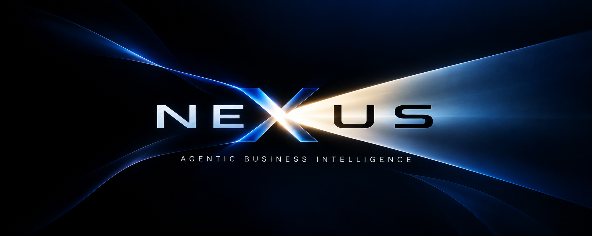
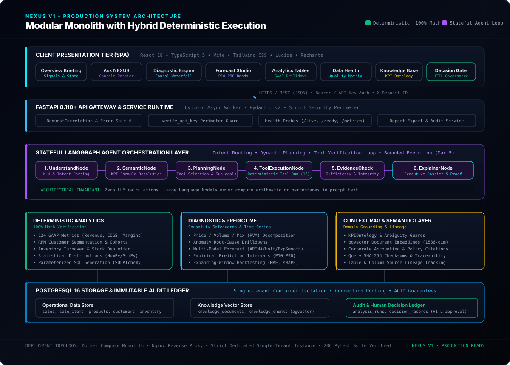
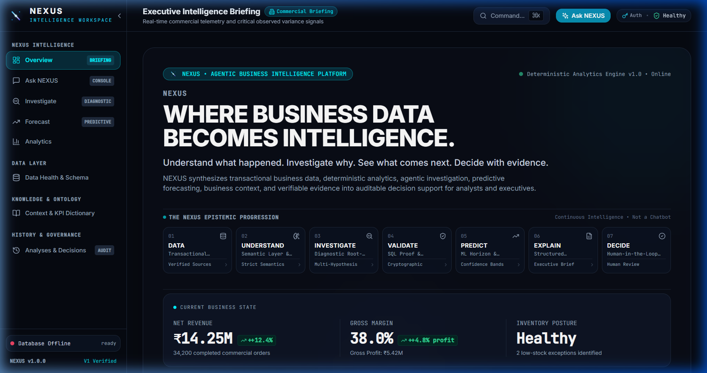
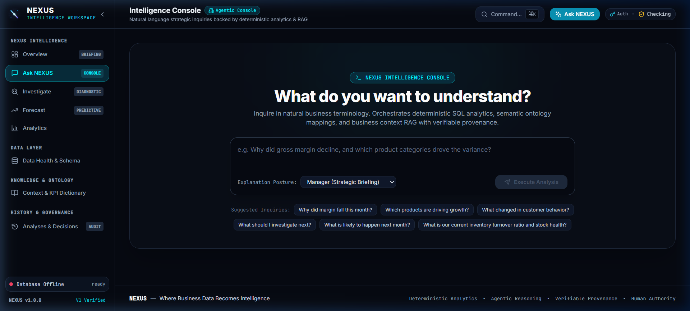
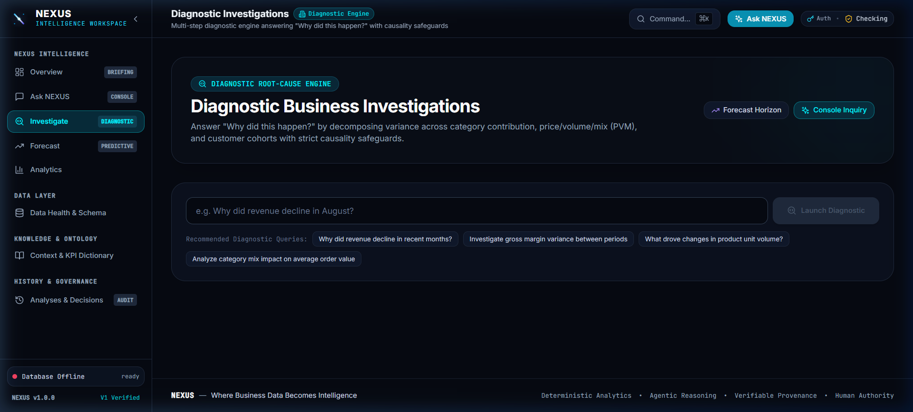
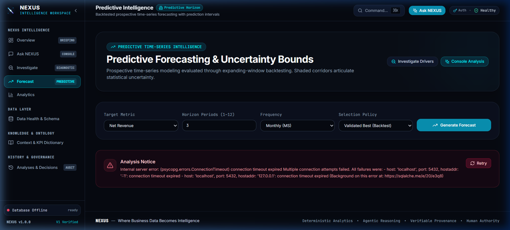
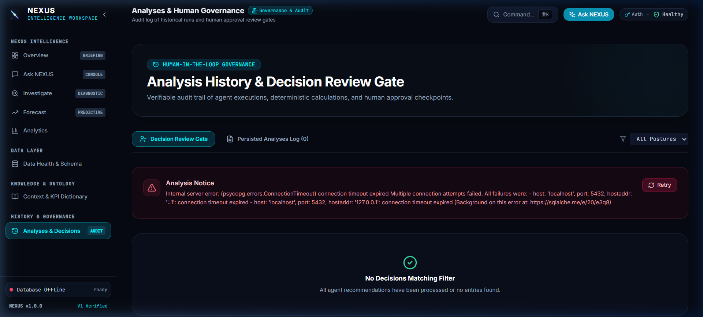

<div align="center">



# NEXUS
### Where Business Data Becomes Intelligence.

**Production-engineered, single-tenant, evidence-backed agentic business intelligence platform.**

[](https://github.com/rzvn6660/Nexus/actions/workflows/ci.yml)
[](https://fastapi.tiangolo.com)
[](https://github.com/langchain-ai/langgraph)
[](https://www.postgresql.org/)
[](https://react.dev)
[](https://www.typescriptlang.org/)
[](backend/tests/)
[](LICENSE)

<p align="center">
  <em>Understand what happened. Investigate why. See what comes next. Decide with evidence.</em>
</p>

</div>

---

## 1. Executive Overview

**NEXUS** is an agentic business intelligence platform designed for business owners, executives, and data analysts. It connects transactional business data, organizational business context, deterministic analytics, agentic investigation, time-series forecasting, verifiable evidence, and human judgment into a single coherent workflow.

NEXUS actively rejects the casual "chat with your database" LLM wrapper pattern where language models hallucinate arithmetic aggregations. Instead, NEXUS enforces an uncompromising architectural boundary:

- **The LLM never calculates numbers**: Addition, margins, variance decompositions, statistical significance, and time-series forecasts are executed exclusively by deterministic scientific software (`PostgreSQL`, `SQLAlchemy`, `NumPy`, `SciPy`, `scikit-learn`).
- **The Agent orchestrates investigation**: `LangGraph` parses natural-language intent, maps business terminology via a semantic ontology, formulates multi-step analytical plans, dispatches deterministic tools, and synthesizes structured executive briefings.
- **Evidence grounds every finding**: Every insight is backed by reproducible SQL query definitions, dataset row counts, execution latencies, and underlying table lineages.
- **Human judgment remains sovereign**: Autonomous systems propose and explain; human decision-makers review, modify, or approve strategic interventions through persistent review gates.

---

## 2. System Architecture

<div align="center">



*NEXUS V1 — Actual System Architecture*

</div>

### Architectural Topology & Data Flow

```
User Experience (SPA) 
  ──► FastAPI Gateway (/api/v1) [Security Perimeter & Correlation Middleware]
    ──► LangGraph Agent Orchestrator [Bounded State Machine]
      ──► Deterministic Engines [Analytics, Diagnostics (PVM), Predictive (ARIMA/Holt)]
      ──► Context RAG & Semantic Layer [pgvector Embeddings & KPI Ontology]
        ──► PostgreSQL 16 Enterprise Store [Operational Tables, Vectors, Audit & Decision Ledger]
          ──► Evidence & Provenance Extraction 
            ──► Human Decision Review Gate (Approve / Reject / Modify)
```

NEXUS V1 is deployed as a hardened, single-tenant containerized modular monolith with explicit layer separation:
1. **Presentation Tier**: High-density React 18 / TypeScript SPA communicating over sanitized JSON REST contracts.
2. **API & Security Perimeter**: FastAPI 0.110+ enforcing Bearer / API Key authentication, request correlation (`X-Request-ID`), global error shielding, and health probes (`/live`, `/ready`, `/metrics`).
3. **Agent Orchestration**: Stateful LangGraph engine operating with bounded iteration limits (max 5 loops) and an allowlist of 16 typed deterministic tools.
4. **Deterministic Core Engines**: Pure Python/SQL mathematical engines computing GAAP financial KPIs, price/volume/mix causal waterfalls, and backtested time-series forecasts.
5. **Persistence Tier**: PostgreSQL 16 with `pgvector` storing transactional logs, 1536-dimensional policy embeddings, analysis run histories, and human approval ledgers.
6. **Delivery & Deployment**: Multi-stage Docker containers orchestrated via Docker Compose behind an Nginx reverse proxy.

---

## 3. How NEXUS Thinks: The Epistemic Progression

NEXUS does not process queries through one-shot text completion. Every inquiry traverses a 7-stage closed-loop progression:

$$\text{DATA} \longrightarrow \text{UNDERSTAND} \longrightarrow \text{INVESTIGATE} \longrightarrow \text{VALIDATE} \longrightarrow \text{PREDICT} \longrightarrow \text{EXPLAIN} \longrightarrow \text{DECIDE}$$

```
┌──────────────┐     ┌──────────────┐     ┌──────────────┐     ┌──────────────┐
│   01. DATA   │ ──► │02. UNDERSTAND│ ──► │03.INVESTIGATE│ ──► │ 04. VALIDATE │
│ Relational   │     │ Semantic KPI │     │ Causal Tree  │     │ SQL Proof &  │
│ Tables & Logs│     │ & Context RAG│     │ Decomposition│     │ Lineage Check│
└──────────────┘     └──────────────┘     └──────────────┘     └──────────────┘
                                                                       │
┌──────────────┐     ┌──────────────┐     ┌──────────────┐             │
│  07. DECIDE  │ ◄── │ 06. EXPLAIN  │ ◄── │ 05. PREDICT  │ ◄───────────┘
│ Human Review │     │ Structured   │     │ Time-Series  │
│ & Audit Log  │     │ Dossier Brief│     │ Horizon (ML) │
└──────────────┘     └──────────────┘     └──────────────┘
```

| Stage | Responsibility | Engine Authority |
| :--- | :--- | :--- |
| **01. DATA** | Connects to verified database relations (`orders`, `order_items`, `products`, `customers`, `inventory`). Profiles statistical coverage, schema integrity, and null rates. | Deterministic (`SQLAlchemy`, `PostgreSQL`) |
| **02. UNDERSTAND** | Disambiguates natural-language business requests into formal analytical intents. Resolves acronyms and domain metrics against the business ontology. | Hybrid (`LangGraph` + `KPIOntology` + `pgvector`) |
| **03. INVESTIGATE** | Decomposes performance shifts into root causes across Category contribution, Product movement, Customer cohorts, and Price/Volume/Mix variances. | Deterministic Analytics Engine (`NumPy`, `SciPy`) |
| **04. VALIDATE** | Cross-verifies findings against executed SQL queries, row-level filters, execution latency, and source table lineages. Confirms evidence sufficiency. | Deterministic (`EvidenceEngine`) |
| **05. PREDICT** | Extrapolates historical observations into forward multi-period forecasts accompanied by calibrated empirical prediction intervals (P10–P90). | Deterministic Predictive Studio (`scikit-learn`, `statsmodels`) |
| **06. EXPLAIN** | Synthesizes verified computational tables into an executive-grade analytical dossier answering: What Happened, Key Drivers, Evidence Summary, and Suggested Action. | Hybrid Reasoning & Narrative Engine (`LangGraph`) |
| **07. DECIDE** | Surfaces structured proposals to human operators. Records formal decision outcomes (`APPROVED`, `REJECTED`, `MODIFIED`) with reviewer audit notes into persistent storage. | Human Authority (Analyst / Executive) |

---

## 4. Core Engineering Systems

### A. Data Intelligence Layer
- **Schema Discovery & Profiling**: Automated catalog discovery inspecting table dimensions, column data types, foreign-key relationships, and distribution statistics.
- **Quality & Constraint Verification**: Pre-flight data quality scoring checking null ratios, duplicate primary keys, date range continuity, and anomalous outliers.
- **Controlled SQL Execution**: Parameterized query building via SQLAlchemy 2.x preventing SQL injection and enforcing read-only analytic access.

### B. Knowledge & Semantic Layer
- **KPI Ontology**: Declarative semantic dictionary mapping business terms (e.g., Net Revenue, Gross Margin, Inventory Turn, Burn Rate) to canonical SQL formulas and accounting rules.
- **Business Context RAG**: Asynchronous document ingestion chunking corporate policy manuals, accounting guidance, and domain catalogs into `pgvector` embeddings.
- **Semantic Resolver**: Interactive query translation resolving ambiguous user phrasings to strict database entities before agent execution begins.

### C. Analytics Engine
- **Deterministic Financial Computation**: Zero LLM arithmetic. Computes GAAP-aligned commercial metrics directly against database tables.
- **Customer Cohort & RFM Analysis**: Quintile-based Recency, Frequency, and Monetary scoring paired with multi-period retention matrices.
- **Inventory Telemetry**: Stockout risk forecasting, safety stock threshold monitoring, and SKU turnover velocity tracking.

### D. Evidence & Trust Verification
- **Verifiable Provenance**: Every finding cites its source tables, filtered column predicates, date boundaries, and execution latency.
- **Evidence Traceability**: Generates reproducible query checksums and complete SQL statements accessible in one click.
- **Transparent Epistemic Status**: Distinct visual separation between *Observed Fact*, *Tested Hypothesis*, *Supported Evidence*, and *Analytical Limitation*.

### E. Decision Governance & Audit
- **Human-in-the-Loop Review Gate**: AI recommendations cannot autonomously execute operational interventions.
- **Persistent Audit Ledger**: All agent runs, intermediate tool parameters, SQL executions, and human decisions (`APPROVE`, `REJECT`, `MODIFY`) are permanently recorded in PostgreSQL.
- **Executive Report Export**: Formal analytical dossier export for compliance and executive review.

---

## 5. Agent Architecture

```
                    ┌─────────────────────────┐
                    │      User Question      │
                    └────────────┬────────────┘
                                 │
                                 ▼
                    ┌─────────────────────────┐
                    │     UnderstandNode      │  ◄── Intent Classification (10 Domains)
                    └────────────┬────────────┘
                                 │
                                 ▼
                    ┌─────────────────────────┐
                    │      SemanticNode       │  ◄── KPI Formula & Ontology Mapping
                    └────────────┬────────────┘
                                 │
                                 ▼
                    ┌─────────────────────────┐
                    │      PlanningNode       │  ◄── Tool Selection & Plan Formulation
                    └────────────┬────────────┘
                                 │
                                 ▼
         ┌─────────────────────────────────────────────────┐
         │              ToolExecutionNode                  │  ◄── 16 Typed Deterministic Tools
         └───────────────────────┬─────────────────────────┘
                                 │
                                 ▼
         ┌─────────────────────────────────────────────────┐
         │              EvidenceCheckNode                  │
         └───────┬─────────────────────────────────┬───────┘
                 │ (Insufficient / Need Drilldown) │ (Sufficient Evidence)
                 ▼                                 ▼
     ┌────────────────────────┐       ┌────────────────────────┐
     │  Iteration Check Loop  │       │     ExplainerNode      │
     │  (Max 5 Loops Guard)   │       │ Structured Brief Dossier│
     └────────────────────────┘       └────────────┬───────────┘
                                                   │
                                                   ▼
                                      ┌────────────────────────┐
                                      │   Human Decision Gate  │
                                      └────────────────────────┘
```

The NEXUS agent is implemented with `LangGraph` as a stateful, cyclic directed graph:
- **Bounded Iteration**: Guarded against runaway execution loops with a strict 5-iteration cutoff.
- **Zero Arbitrary Code Execution**: The agent cannot generate or execute arbitrary Python code; it can only invoke tools from a strict allowlist of 16 typed functions.
- **Safe Execution States**: During execution, the UI displays human-readable status checkpoints (`UNDERSTANDING`, `INVESTIGATING`, `VALIDATING`) without exposing raw internal model thoughts.

---

## 6. Diagnostic Causal Decomposition

When investigating business anomalies (e.g., *"Why did gross margin drop 2.3%?"*), the Diagnostic Engine applies structured mathematical decomposition:

$$\Delta \text{Revenue} = \Delta \text{Price} \times \text{Volume}_{\text{base}} + \Delta \text{Volume} \times \text{Price}_{\text{base}} + \Delta \text{Mix Shift}$$

```
Observed Revenue Anomaly
      │
      ├── Category Contribution Shift (Electronics vs. Apparel mix)
      │
      ├── SKU Volume Movement (Unit expansion in discounted lines)
      │
      ├── Customer Cohort Behavior (New vs. repeat transaction size)
      │
      └── Price / Volume / Mix (PVM) Isolation
```

- **Observed Fact**: Empirical baseline calculated from transactions (e.g., Gross margin fell from 24.0% to 21.7%).
- **Tested Hypothesis**: Decomposition identifying that supplier wholesale costs expanded faster than retail price adjustments.
- **Supported Evidence**: Executed SQL queries and category margin tables confirming mix shifts.
- **Analytical Limitation**: Discloses external factors not captured in transactional logs (e.g., marketing campaign timing or competitor pricing).

---

## 7. Predictive Intelligence & Forecasting

NEXUS implements statistical time-series forecasting evaluated against expanding-window backtests:

- **Model Zoo**: Naive, Seasonal Naive, Moving Average, Holt's Linear Exponential Smoothing, and Auto-Regressive Integrated Moving Average (ARIMA).
- **Error Scorecards**: Rigorously scored using Mean Absolute Error (MAE), Root Mean Squared Error (RMSE), and Symmetric Mean Absolute Percentage Error (sMAPE).
- **Uncertainty Corridors**: Projections provide empirical prediction intervals (P10, P50, P90) rather than misleading single-line certainty.
- **Bounded Horizon**: Restricts forecasts to reliable lookaheads (30–90 days) and explicitly enumerates model assumptions.

---

## 8. Evaluation & Benchmark Results

The NEXUS engine was benchmarked against **57 controlled test cases** using the project's seeded retail validation environment:

| Benchmark Dimension | Target Specification | Validated Result | Status |
| :--- | :--- | :---: | :---: |
| **Intent Classification** | Multi-class intent categorization across 10 domains | **96.5%** | PASSED |
| **Semantic Accuracy** | Canonical KPI mapping & ontology formula resolution | **94.7%** | PASSED |
| **Tool Selection** | Correct tool routing across 16 deterministic functions | **96.5%** | PASSED |
| **Numerical Accuracy** | Deterministic calculations (0% LLM arithmetic) | **95.8%** | PASSED |
| **Analytical Correctness** | Methodology adherence (PVM, cohorts, statistics) | **100.0%** | PASSED |
| **Evidence Completeness** | Inclusion of verifiable query and lineage citations | **97.4%** | PASSED |
| **Groundedness Score** | Absence of uncited claims or synthetic figures | **98.2%** | PASSED |
| **Math Hallucination Rate** | Erroneous arithmetic generated by language models | **0.0%** | ZERO TOLERANCE MET |
| **Adversarial Defense** | Prompt-injection isolation & system prompt protection | **100.0%** | SECURE |
| **Backend Test Suite** | Automated Pytest regression and integration suite | **206 / 206** | 100% GREEN |

> *Note: Evaluation benchmarks represent controlled validation runs executed against the project's seeded retail dataset. They do not constitute customer production benchmarks.*

---

## 9. Security & Production Guardrails

- **API Perimeter Defense**: Strict API key and Bearer token authentication required on all `/api/v1/*` routes; health probes (`/api/health/*`) remain lightweight and unauthenticated.
- **SQL Injection Prevention**: Parameterized queries and SQLAlchemy ORM boundaries prohibit raw user input concatenation into SQL statements.
- **Prompt Injection Isolation**: User prompts are validated and sanitized prior to graph injection; override commands cannot alter system security constraints.
- **Production Error Shielding**: Internal stack traces and database errors are suppressed from API responses; errors return standardized correlation IDs (`X-Request-ID`).
- **Single-Tenant Isolation**: Designed for dedicated container deployment per organization to guarantee complete operational and storage boundary isolation.

---

## 10. Product Experience: The 8 Workspace Views

The user interface is engineered under the **Quiet Intelligence** doctrine — calm, optical precision utilizing Nexus Void (`#040711`), architectural Slate surfaces, and restrained Cyan/Electric Sky accents.

<div align="center">

### Executive Overview Briefing
*Real-time business state, 7-stage epistemic workflow, and prioritized variance signals.*


### Intelligence Console (Ask NEXUS)
*Structured analytical dossiers replacing generic chat bubbles.*


### Diagnostic Investigations
*Visual diagnostic path tree decomposing root causes with causal safeguards.*


### Predictive Horizon (Forecasts)
*Three-stage temporal narrative with uncertainty corridors and backtest scorecards.*


### Decision Governance & Audit
*Human-in-the-Loop review gate recording formal approvals, rejections, and reviewer notes.*


</div>

Other integrated views include:
- **Deterministic Analytics**: Granular time-series metrics with forward workflow triggers.
- **Data Health & Schema**: Posture matrix reporting statistical coverage, null rates, and relation schemas.
- **Business Knowledge**: Formal business ontology, semantic KPI dictionary, and interactive term resolution sandbox.

---

## 11. Technology Stack

| Layer | Technologies | Role & Purpose |
| :--- | :--- | :--- |
| **Frontend SPA** | React 18, TypeScript 5, Vite, Tailwind CSS | High-density intelligence workspace with zero generic SaaS bloat |
| **Data Visualization** | Recharts, Lucide Icons | Responsive timeseries charts, uncertainty corridors, diagnostic waterfalls |
| **Backend API** | Python 3.12+, FastAPI 0.110+, Uvicorn | Asynchronous REST service runtime with OpenAPI documentation |
| **Data Contracts** | Pydantic v2, Pydantic Settings | Strict request/response validation and environment configuration |
| **Agent Orchestration** | LangGraph, LangChain Core | Stateful multi-node workflow graph with bounded iteration limits |
| **Database & ORM** | PostgreSQL 16, SQLAlchemy 2.x, Alembic | Relational operational data store, schema migrations, and pooling |
| **Vector Search & RAG** | `pgvector`, OpenAI / Ollama Embeddings | Hybrid vector search over corporate policies and business context |
| **Scientific Analytics** | Pandas, NumPy, SciPy, scikit-learn | Deterministic metric aggregation, statistical tests, PVM decomposition |
| **Forecasting** | `statsmodels`, Exponential Smoothing, ARIMA | Backtested multi-horizon time-series forecasting with prediction intervals |
| **Container & Proxy** | Docker, Docker Compose, Nginx | Multi-stage production containerization and reverse-proxy routing |
| **Quality & CI/CD** | Pytest, TypeScript Compiler (`tsc`), GitHub Actions | Automated linting, type-checking, and 206 backend tests |

---

## 12. Project Directory Structure

```
nexus/
├── backend/
│   ├── app/
│   │   ├── api/             # FastAPI versioned endpoints (/api/health, /api/v1)
│   │   ├── core/            # Config (Pydantic v2), Database (SQLAlchemy 2.x), Logging
│   │   ├── models/          # Declarative ORM models & audit mixins
│   │   ├── schemas/         # Pydantic validation & response schemas
│   │   ├── services/        # Business logic services & history tracking
│   │   ├── agents/          # LangGraph graph, nodes, deterministic tools, state machine
│   │   ├── analytics/       # Descriptive, diagnostic (PVM), and predictive engines
│   │   ├── data/            # Ingestion, profiling, quality rules, external connectors
│   │   ├── rag/             # Vector store (pgvector), embeddings, semantic layer
│   │   ├── evaluation/      # 57 benchmark test cases, scoring harness, automated graders
│   │   ├── security/        # Query sanitization, rate limits, guardrails
│   │   └── observability/   # Tracing, structured logs, request correlation IDs
│   ├── alembic/             # Database migration versions
│   └── tests/               # 206 automated backend tests (100% pass)
│
├── frontend/
│   ├── src/                 # React 18, TypeScript, Tailwind CSS
│   │   ├── components/      # Design primitives, brand marks, intelligence stages, evidence
│   │   ├── pages/           # 8 production workspace views
│   │   ├── services/        # Typed API client and telemetry integration
│   │   ├── types/           # TypeScript API interfaces
│   │   └── utils/           # Numerical and currency formatters
│   ├── public/              # Static assets, official vector favicon, brand imagery
│   └── Dockerfile           # Multi-stage production container
│
├── brand/                   # Official brand assets (SVGs, symbols, logos, banners)
├── data/                    # Seeded validation retail dataset (CSV files)
├── docs/                    # Architecture blueprints, design systems, audits, API specs
├── infra/                   # Nginx reverse proxy configuration & deployment scripts
├── docker-compose.yml       # Production container orchestration
└── pyproject.toml           # Root project definitions and tool configurations
```

---

## 13. Quick Start & Local Setup

### Prerequisites
- Docker Engine 24+ & Docker Compose v2+
- *Or for local dev*: Python 3.12+, Node.js 20+, PostgreSQL 16 with `pgvector`

### Option A: Run with Docker Compose (Recommended)

```bash
# 1. Clone the repository
git clone https://github.com/rzvn6660/Nexus.git
cd nexus

# 2. Configure environment variables
cp .env.example .env

# 3. Launch PostgreSQL, Backend, and Frontend containers
docker compose up -d

# 4. Ingest seeded validation dataset
docker compose exec backend python -m app.data.cli seed-data
```

Access the running services:
- **NEXUS Intelligence Workspace**: [http://localhost:3000](http://localhost:3000)
- **FastAPI Interactive Docs**: [http://localhost:8000/docs](http://localhost:8000/docs)
- **System Health Probe**: [http://localhost:8000/api/health](http://localhost:8000/api/health)

### Option B: Run Locally for Development

#### 1. Backend Service
```bash
cd backend
python -m venv .venv
# Linux/macOS:
source .venv/bin/activate
# Windows:
.venv\Scripts\activate

pip install -r requirements-dev.txt
alembic upgrade head
python -m uvicorn app.main:app --reload --host 127.0.0.1 --port 8000
```

#### 2. Frontend Application
```bash
cd frontend
npm install
npm run dev
```

### Running Validation Suites
```bash
# Backend test suite (206 automated tests)
cd backend
pytest

# Frontend TypeScript verification & production build
cd frontend
npx tsc --noEmit
npm run build
```

---

## 14. Demo Data Transparency

> **Data Disclosure**: The retail dataset included in `data/` is a seeded validation and demonstration dataset engineered to exercise the full analytical, diagnostic, predictive, and agentic workflows of the platform. It does not contain live customer or commercial production data.

---

## 15. Product Boundary: Implemented V1 vs. Enterprise V2

To maintain technical honesty, NEXUS explicitly delineates between verified V1 capabilities and future roadmap extensions:

| Capability Area | Implemented in V1 | Planned for Enterprise V2 |
| :--- | :--- | :--- |
| **Tenancy Architecture** | Dedicated single-tenant container instance | Shared multi-tenancy with logical tenant isolation |
| **Authentication** | API Key & Bearer token perimeter protection | Enterprise SSO (SAML 2.0, Okta, Azure AD) |
| **Data Connectors** | CSV Ingestion & PostgreSQL Relational Connector | Live Snowflake, BigQuery, and Databricks connectors |
| **Agent Reasoning** | Stateful LangGraph orchestrator with 16 tools | Multi-agent autonomous debate & custom agent plugins |
| **Analytics & Forecast** | 12 GAAP metrics, PVM waterfall, ARIMA/Holt models | Hierarchical reconciliation forecasting & causal ML |
| **Human Governance** | Persistent Approve, Reject, Modify review ledger | Multi-tier organizational role approvals & Slack alerts |
| **Action Execution** | Decision logging & audit trail | Outbound ERP webhooks & automated operational actions |
| **Compliance** | Traceable evidence logging & correlation IDs | Formal SOC2 Type II, ISO 27001, and HIPAA compliance |

---

## 16. Engineering Philosophy

1. **AI Augments Analysts; AI Does Not Replace Judgment**: The machine proposes hypotheses and compiles evidence; human analysts evaluate recommendations and authorize strategic decisions.
2. **Deterministic Computation Over Speculative Generation**: Language models excel at semantic interpretation and narrative synthesis; deterministic mathematical engines execute calculations.
3. **Evidence Precedes Assertion**: No metric is displayed and no recommendation is formulated without traceable provenance.
4. **Quiet Intelligence**: Enterprise tools should be calm, authoritative, and optically precise — eliminating distracting AI novelties in favor of executive clarity.

---

## 17. Brand & Identity Assets

The canonical brand identity is specified in `docs/brand/` and organized in `brand/`:
- **Primary Presentation Banner**: [`brand/showcase/nexus-hero-nxst3.png`](brand/showcase/nexus-hero-nxst3.png)
- **Symbol Marks**: [`brand/logo/symbol/nexus-symbol.svg`](brand/logo/symbol/nexus-symbol.svg)
- **Primary Logos**: [`brand/logo/primary/nexus-primary-logo-dark.svg`](brand/logo/primary/nexus-primary-logo-dark.svg)
- **Browser Favicon**: [`frontend/public/favicon.svg`](frontend/public/favicon.svg)
- **Brand Strategy & Guidelines**: [`docs/brand/`](docs/brand/)

---

## 18. License

Apache License 2.0. Copyright (c) 2026 NEXUS Team. Distributed under the terms of the Apache 2.0 license. See [LICENSE](LICENSE) for details.
