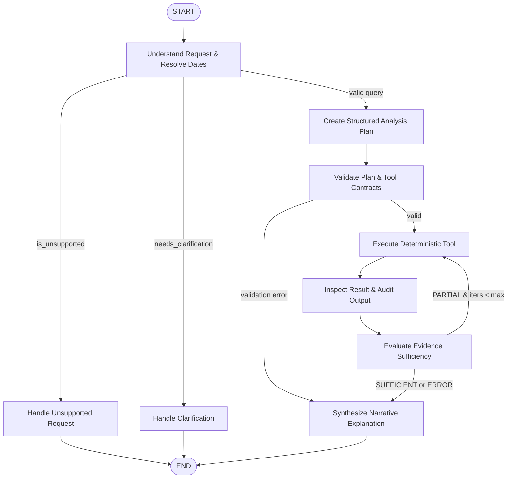

# NEXUS Agent Architecture — Phase 4

## Executive Overview

**NEXUS** is an Agentic Business Intelligence Platform whose tagline is:
> *"Where Business Data Becomes Intelligence."*

Phase 4 introduces the first stateful agent orchestration layer, constructed using **LangGraph**. The NEXUS agent bridges natural language business questions and deterministic business analytics without delegating arithmetic or data aggregation to language models.

---

## The Hybrid Intelligence Principle

The core architectural tenet of NEXUS is:
> **The LLM is an Orchestrator and Explainer — NOT a Calculator.**

```
RAW BUSINESS DATA
        ↓
TRUSTED DATA LAYER (PostgreSQL / SQLite)
        ↓
ANALYTICS SERVICE (Deterministic Phase 3)
        ↓
EVIDENCE RECORDS & STRUCTURED RESULTS
        ↓
LANGGRAPH AGENT (Stateful Orchestration)
        ↓
GROUNDED EXPLANATION & CITATION
```

### Why LLMs Must Not Calculate Numbers
- Large Language Models are probabilistic token predictors prone to hallucinations, arithmetic drift, and rounding inconsistencies.
- Financial reporting demands GAAP-aligned exactness, mathematical reconciliation, and reproducible results.
- In NEXUS, all calculations (Gross Revenue, Net Profit, PVM Decomposition, RFM Scores, Welch's t-test, Inventory Turnover) are executed deterministically by SQL queries and Python scientific libraries (`scipy`, `numpy`, `pandas`).
- The LLM's role is strictly confined to:
  1. **Understanding** the business intent and extracting parameters.
  2. **Formulating** an inspectable multi-step analysis plan.
  3. **Translating** structured findings into coherent narratives tailored to the user's role.

---

## LangGraph Workflow Topology

The stateful graph coordinates controlled transitions between discrete execution nodes:



---

## Core Components

| Component | Module | Responsibility |
|---|---|---|
| **State Definition** | `app.agents.state.models.AgentState` | Typed dictionary tracking user query, resolved dates, intent, plan, tool calls, tool results, evidence, and iterations. |
| **Date Interpreter** | `app.agents.tools.date_interpreter.DateInterpreter` | Deterministic parsing of relative temporal phrases (`last month`, `this quarter`, `August 2024`) to ISO date ranges and comparison baselines. |
| **Tool Registry** | `app.agents.tools.registry.ToolRegistry` | Centralized registry wrapping 16 Phase 3 `AnalyticsService` methods with Pydantic input validation. |
| **Graph Workflow** | `app.agents.graph.workflow.agent_graph` | Compiled `StateGraph` executing conditional branching, multi-step loops, and error boundaries. |
| **LLM Providers** | `app.agents.providers` | Pluggable vendor abstraction (`BaseLLMProvider`, `MockLLMProvider`, `OpenAIProvider`). |
| **Agent Facade** | `app.agents.service.NexusAgentService` | Orchestration interface coordinating graph invocation, database sessions, and `AgentResponse` generation. |
| **Agent API** | `app.api.v1.endpoints.agent` | `POST /api/v1/agent/analyze` versioned REST endpoint. |

---

## Phase Boundary Separation

### Phase 4 (Implemented Now)
- Stateful LangGraph orchestration
- Deterministic tool registry binding to Phase 3 analytics
- Pydantic-validated tool inputs and structured execution outputs
- Traceable `EvidenceRecord` propagation through state
- Multi-step execution (e.g. diagnostic variance analysis)
- Offline deterministic testing via `MockLLMProvider`
- REST endpoint `POST /api/v1/agent/analyze`

### Phase 5+ (Future Scope — Locked)
- Vector databases, pgvector, embeddings, and document retrieval (RAG)
- Full semantic layer with KPI ontology and business glossary
- Autonomous anomaly detection and unsolicited investigation triggers
- Predictive ML, forecasting, and churn models
- Product UI dashboard redesign
