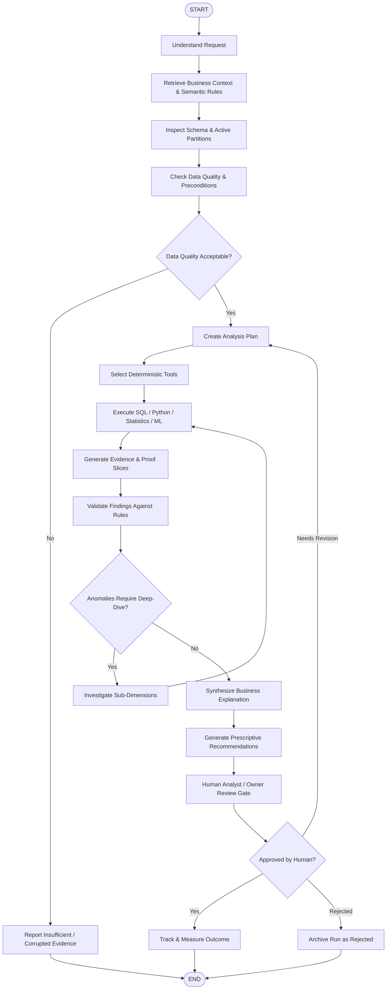

# NEXUS Agent Architecture (Planned — Phase 3)

## 1. Overview
The agent layer in NEXUS is orchestrated using **LangGraph** to deliver stateful, auditable, and resilient multi-step analysis. 

Rather than relying on a monolithic autonomous agent with unrestricted access, NEXUS implements a **typed state machine** where discrete nodes perform constrained, specialized functions with strict validation boundaries.

---

## 2. State Machine Topology



---

## 3. Typed Agent State Schema
The state graph passes a structured Pydantic object between nodes:

```python
class AnalysisState(TypedDict):
    request_id: str
    user_query: str
    business_context: Dict[str, Any]
    active_dataset_metadata: Dict[str, Any]
    data_quality_report: Optional[Dict[str, Any]]
    analysis_plan: List[str]
    executed_queries: List[Dict[str, Any]]
    raw_results: List[Dict[str, Any]]
    evidence_items: List[Dict[str, Any]]
    validation_status: str  # valid | invalid | insufficient_evidence
    narrative_explanation: Optional[str]
    prescriptive_recommendations: List[Dict[str, Any]]
    human_feedback: Optional[Dict[str, Any]]
```

---

## 4. Node Responsibilities
1. **Understand Node**: Parses user queries into business dimensions, metric requirements, and time filters.
2. **Context Node**: Queries the semantic layer and RAG store for metric formulas (e.g. `Gross Margin = (Net Sales - COGS) / Net Sales`).
3. **Data Quality Node**: Profiles the target data slice. If null rates exceed threshold or records are missing, halts the workflow with an explicit "Insufficient Evidence" status.
4. **Tool Dispatcher Node**: Dispatches execution requests to sandboxed, read-only SQL and Python scientific math functions.
5. **Validation Node**: Compares computational outputs against business invariants. Confirms that no hallucinated metrics are injected.
6. **Explanation Node**: Uses an LLM with structured output to generate concise, professional executive summaries grounded exclusively in the evidence table.
7. **Human Gate Node**: Pauses graph execution using LangGraph checkpoints until an analyst or business owner reviews the evidence and approves next steps.
