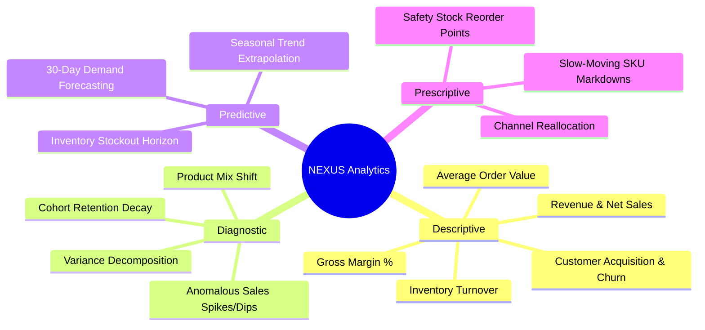

# NEXUS Deterministic Analytics Architecture (Planned — Phase 2)

## 1. Core Principle: Zero LLM Math
Large Language Models are probabilistic token predictors; they are fundamentally unsuitable for deterministic accounting, exact metric aggregation, and financial calculations.

In NEXUS:
- All additions, subtractions, multiplications, divisions, percentages, and summaries are computed in **SQL** or **Python**.
- All statistical tests (t-tests, ANOVA, Mann-Whitney, confidence intervals) are evaluated via **SciPy** and **NumPy**.
- All predictive projections are trained and evaluated with **scikit-learn** and dedicated time-series models.
- The LLM receives pre-computed results as structured JSON and acts purely as an interpreter, planner, and communicator.

---

## 2. Analytics Taxonomy

---

## 3. Subsystem Breakdown

### 3.1 Descriptive Analytics (`app.analytics.descriptive`)
- Computes foundational business metrics over customizable temporal partitions (daily, weekly, monthly, quarterly).
- Standardizes calculation of core retail KPIs:
  - $\text{Net Sales} = \sum \text{Gross Sales} - \sum \text{Discounts} - \sum \text{Refunds}$
  - $\text{Gross Margin} = \frac{\text{Net Sales} - \text{COGS}}{\text{Net Sales}}$
  - $\text{Inventory Turnover} = \frac{\text{Cost of Goods Sold}}{\text{Average Inventory Value}}$

### 3.2 Diagnostic Analytics (`app.analytics.diagnostic`)
- Automatically decomposes variance when a KPI experiences an unexpected delta.
- Evaluates whether revenue shifts are driven by:
  1. **Volume effect** (fewer units sold).
  2. **Price effect** (lower average realized price).
  3. **Mix effect** (shift toward lower-margin SKUs).

### 3.3 Predictive Analytics (`app.analytics.predictive` & `forecasting`)
- Fits deterministic time-series models to historical sales streams.
- Computes explicit prediction intervals (e.g. 90% confidence bands) to convey uncertainty to stakeholders rather than providing false precision.

### 3.4 Prescriptive Analytics (`app.analytics.prescriptive`)
- Formulates optimization models for inventory management.
- Evaluates economic order quantity (EOQ) and dynamic safety stock thresholds based on supplier lead times and historical demand variance.
