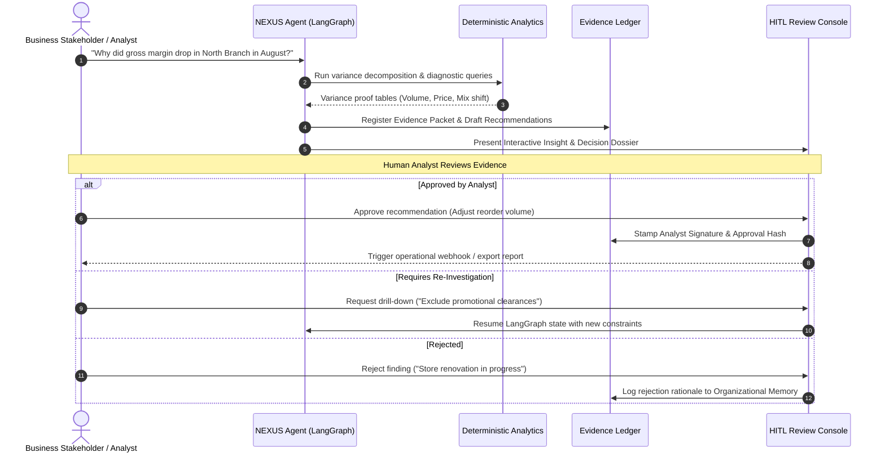

# NEXUS Human-in-the-Loop (HITL) Workflow (Planned — Phase 4)

## 1. Philosophical Stance: Augmentation, Not Replacement
NEXUS is explicitly designed to **augment professional data analysts and business owners**, not replace them.

Data analysis in the enterprise involves tacit domain knowledge, regulatory compliance, competitive context, and organizational politics that no AI model can possess. NEXUS operates as an **analytical copilot** that eliminates repetitive data wrangling, initial anomaly scanning, and manual SQL drafting, freeing human experts to exercise strategic judgment.

---

## 2. The Human Review Gate

---

## 3. The 3 Review States
Every recommendation produced by NEXUS must pass through one of three human review dispositions:

1. **Approved**: The human analyst confirms the evidence, verifies the business assumptions, and endorses the recommendation. The decision is committed to the outcome-tracking register.
2. **Refined / Investigated Further**: The analyst injects domain context (e.g., *"We had a flash clearance sale on August 14th; exclude that weekend"*), sending the agent back into the LangGraph loop to recompute exact figures.
3. **Rejected with Rationale**: The analyst dismisses the insight and provides a reason. This feedback is automatically vectorized into the RAG Organizational Memory layer so subsequent analyses are informed by this context.

---

## 4. Closed-Loop Outcome Measurement
Once an approved recommendation is executed (e.g. modifying safety stock from 14 days to 21 days), NEXUS schedules an automatic evaluation milestone (e.g. +30 days, +60 days).

At that milestone, the **Measure Outcome** node compares the actual post-implementation metrics against the predicted trajectory, closing the loop on business intelligence impact.
