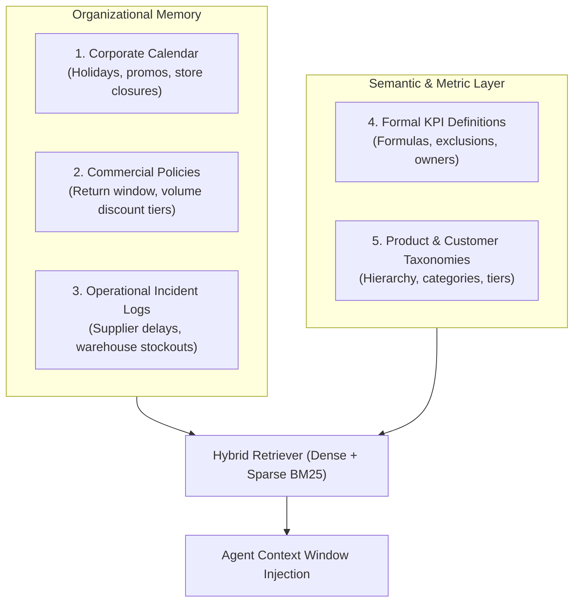

# NEXUS RAG & Business Context Architecture (Planned — Phase 3)

## 1. Role of RAG in NEXUS
RAG (Retrieval-Augmented Generation) in NEXUS is **not** a general document search tool. It serves as an **Organizational Context Engine** that equips agents with the proprietary business knowledge required to correctly interpret numbers.

Without business context, an agent seeing an 80% revenue drop on a specific Tuesday might declare an operational crisis—unaware that the business is closed on Tuesdays or that a known scheduled power outage occurred.

---

## 2. Context Dimensions Ingested

---

## 3. Retrieval Architecture
- **Vector Store Abstraction**: Implements a unified interface supporting `pgvector` (native PostgreSQL vector extension) as the default local store, with swappable connectors for Qdrant and Chroma.
- **Embeddings Abstraction**: Decoupled embedding generator interface supporting local sentence-transformers, OpenAI embeddings, and Google Gemini embeddings.
- **Hybrid Search**: Combines dense semantic similarity search with BM25 keyword matching to prevent misses on specific SKU codes, promotion names, or company-specific acronyms.
- **Time-Aware Context Filtering**: Filters corporate context by the temporal window of the analytical query, preventing 2024 promotional rules from distorting 2023 historical comparisons.
