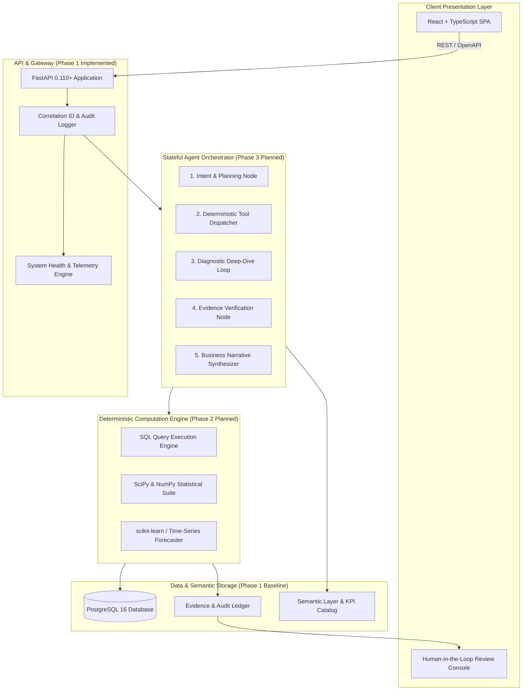

# NEXUS System Architecture

## 1. Executive Summary
**NEXUS** is an **Agentic Business Intelligence Platform** designed to bridge the chasm between raw transactional data and strategic decision-making. 

NEXUS does **not** treat analytics as a casual "chat with CSV" exercise. Instead, it pairs **deterministic computational precision** (SQL queries, descriptive/diagnostic statistics, scientific computing, time-series forecasting) with **stateful AI reasoning** (request disambiguation, iterative planning, automated anomaly investigation, narrative synthesis, and prescriptive recommendations).

---

## 2. Core Architectural Philosophy: Hybrid Intelligence
A central architectural tenet of NEXUS is the strict boundary between **deterministic computation** and **probabilistic generation**:

| Layer | Responsibility | Technology Stack | Deterministic? |
| :--- | :--- | :--- | :--- |
| **Presentation Layer** | Visualization, analyst review, approval gating | React 18, TypeScript, Tailwind CSS | Yes |
| **API Gateway** | Routing, auth, rate limiting, request correlation | FastAPI, Pydantic v2 | Yes |
| **Agent Orchestrator** | Task planning, tool dispatching, verification loop | LangGraph, Pydantic Structured Outputs | Probabilistic / Stateful |
| **Deterministic Analytics** | Aggregation, variance analysis, statistics, forecasting | Pandas, NumPy, SciPy, scikit-learn, SQL | **Yes (100% Exact)** |
| **Semantic Layer** | Explicit business logic, KPI definitions, formulas | Pydantic Schemas, SQL Dialects | Yes |
| **RAG & Context** | Organizational memory, domain rules, taxonomies | Vector Store (pgvector), Hybrid Search | Probabilistic Retrieval |
| **Evidence Engine** | Query hashing, proof slices, assumption tracking | Hash verification, audit loggers | Yes |
| **Database Store** | Primary relational persistence & analytics storage | PostgreSQL 16, SQLAlchemy 2.x | Yes |

> [!IMPORTANT]
> **Zero LLM Calculations**: The Large Language Model never performs addition, multiplication, percentages, aggregations, or statistical tests in its prompt context. All numerical figures in NEXUS originate from verified SQL or Python analytical tool executions.

---

## 3. High-Level System Topology

---

## 4. End-to-End 11-Step Workflow

Every business intelligence request in NEXUS traverses a closed-loop 11-step pipeline:

1. **Data**: Connect to and ingest verified operational datasets (Sales, Customers, Products, Inventory, Expenses).
2. **Understand**: Natural Language Understanding (NLU) resolves user queries into explicit business concepts.
3. **Check**: Data quality profiling tests null rates, distribution drift, and constraint integrity.
4. **Analyze**: Deterministic SQL and Python routines calculate exact numbers, gross margins, and variances.
5. **Investigate**: Multi-turn agent sub-routines drill down into anomaly drivers (e.g., category drop vs. churn).
6. **Validate**: The evidence engine cross-references all claims against executed query outputs and error bands.
7. **Explain**: Generates clear, executive-grade natural language explanations with zero hallucinated figures.
8. **Predict**: Extrapolates short-term demand or inventory depletion trends using proven time-series algorithms.
9. **Recommend**: Prescribes specific, low-risk operational adjustments based on predefined business rules.
10. **Human Decision**: Presents complete evidence, assumptions, and recommendations to the human analyst for approval.
11. **Measure Outcome**: Tracks downstream metrics over time to evaluate decision impact and refine predictive baselines.

---

## 5. Current Implementation vs. Roadmap

| Component | Status | Implementation Details |
| :--- | :--- | :--- |
| **FastAPI Core & Router** | **Implemented (Phase 1)** | Asynchronous server, `/api/health`, `/api/v1` versioning, request correlation |
| **Settings & Config** | **Implemented (Phase 1)** | Pydantic v2 `BaseSettings` reading environment variables safely |
| **SQLAlchemy 2.x & DB** | **Implemented (Phase 1)** | Engine pooling, session lifecycle, connection health check |
| **Database Migrations** | **Implemented (Phase 1)** | Alembic setup with `alembic.ini`, `env.py`, and version registry |
| **Docker & Compose** | **Implemented (Phase 1)** | Multi-service Compose (`postgres`, `backend`, `frontend`) |
| **Frontend Foundation** | **Implemented (Phase 1)** | React 18, TypeScript, Vite, Tailwind CSS, live health telemetry dashboard |
| **Test Suite** | **Implemented (Phase 1)** | Pytest test runner validating health endpoints, config, and DB fallbacks |
| **Retail Data Schemas** | *Planned (Phase 2)* | Sales, Customers, Products, Inventory, Expenses schema & seed data |
| **Deterministic Analytics** | *Planned (Phase 2)* | Mathematical computation modules (SciPy, Pandas, scikit-learn) |
| **LangGraph Agent Layer** | *Planned (Phase 3)* | Stateful multi-node cyclic workflow with checkpointing |
| **Semantic KPI Layer** | *Planned (Phase 3)* | Standardized business metric formulas and metric catalog |
| **Evidence Engine** | *Future (Phase 4)* | Cryptographic SQL hashing, data slice proof generation, and verification |
