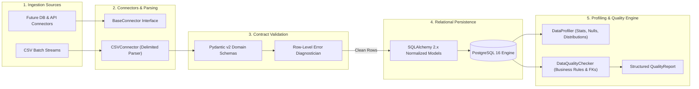

# NEXUS Data Layer Architecture

## 1. Architectural Scope
Phase 2 establishes the **NEXUS Data Layer** for a representative small retail and distribution enterprise. 

This layer transforms raw, noisy operational events into validated, strongly typed, and auditable relational data structures. It provides the empirical foundation upon which the future Phase 3 deterministic analytics engine and Phase 5 semantic layer will operate.

---

## 2. Ingestion to Validation Pipeline

---

## 3. Structural Tenets

1. **Fixed-Point Financial Arithmetic**:
   - Floating-point representations (`FLOAT`, `DOUBLE PRECISION`) are strictly forbidden for monetary transactions.
   - All currencies, line totals, discounts, taxes, and overhead costs utilize fixed-precision `NUMERIC(12, 2)` mapped to Python `Decimal`.
2. **Deterministic Validation**:
   - Zero LLM code execution is permitted during ingestion, profiling, or quality checks. All validations run deterministic Python rules and database constraint checks.
3. **Reconcilable Transaction Lineage**:
   - Every transaction item enforces $(quantity \times unit\_price) - discount\_amount = line\_total$.
   - Every transaction header enforces $subtotal - discount\_amount + tax\_amount = total\_amount$.
4. **Non-Destructive Ingestion**:
   - When raw records fail validation, malformed rows are isolated into structured diagnostics (`IngestionRowError`) rather than silently dropped or altered.
