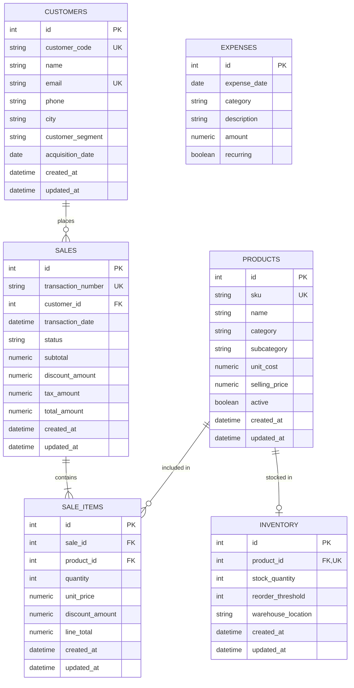

# NEXUS Database Schema Specification

## 1. Entity Relationship Diagram (ERD)

---

## 2. Table Specifications

### 2.1 `customers`
| Column | Type | Nullable | Constraints & Indexes | Description |
| :--- | :--- | :---: | :--- | :--- |
| `id` | `INTEGER` | No | `PRIMARY KEY`, Autoincrement | Internal surrogate key |
| `customer_code` | `VARCHAR(32)` | No | `UNIQUE`, `INDEX` | External business identifier (e.g. CUST-00042) |
| `name` | `VARCHAR(255)` | No | | Full individual or company name |
| `email` | `VARCHAR(255)` | No | `UNIQUE`, `INDEX` | Primary communication email |
| `phone` | `VARCHAR(64)` | Yes | | Primary phone contact number |
| `city` | `VARCHAR(128)` | No | `INDEX` | Geographic market / branch region |
| `customer_segment`| `VARCHAR(64)` | No | `INDEX` | Retail, Wholesale, Corporate, or VIP |
| `acquisition_date`| `DATE` | No | `INDEX` | Cohort tracking baseline date |
| `created_at` | `TIMESTAMPTZ` | No | | UTC audit timestamp |
| `updated_at` | `TIMESTAMPTZ` | No | | UTC audit timestamp |

### 2.2 `products`
| Column | Type | Nullable | Constraints & Indexes | Description |
| :--- | :--- | :---: | :--- | :--- |
| `id` | `INTEGER` | No | `PRIMARY KEY`, Autoincrement | Internal surrogate key |
| `sku` | `VARCHAR(64)` | No | `UNIQUE`, `INDEX` | Stock Keeping Unit code |
| `name` | `VARCHAR(255)` | No | | Merchandising catalog name |
| `category` | `VARCHAR(128)` | No | `INDEX` | High-level product category |
| `subcategory` | `VARCHAR(128)` | No | `INDEX` | Granular product subcategory |
| `unit_cost` | `NUMERIC(12, 2)`| No | `CHECK (unit_cost >= 0)` | Landed Cost of Goods Sold (COGS) |
| `selling_price`| `NUMERIC(12, 2)`| No | `CHECK (selling_price >= 0)`| Base catalog selling price |
| `active` | `BOOLEAN` | No | `INDEX`, Default: `true` | Catalog lifecycle flag |
| `created_at` | `TIMESTAMPTZ` | No | | UTC audit timestamp |
| `updated_at` | `TIMESTAMPTZ` | No | | UTC audit timestamp |

### 2.3 `sales`
| Column | Type | Nullable | Constraints & Indexes | Description |
| :--- | :--- | :---: | :--- | :--- |
| `id` | `INTEGER` | No | `PRIMARY KEY`, Autoincrement | Internal surrogate key |
| `transaction_number`| `VARCHAR(64)`| No | `UNIQUE`, `INDEX` | Invoice / Receipt number |
| `customer_id` | `INTEGER` | No | `FK -> customers.id`, `INDEX` | Purchasing customer |
| `transaction_date` | `TIMESTAMPTZ`| No | `INDEX` | Order execution timestamp |
| `status` | `VARCHAR(32)` | No | `INDEX`, Default: `'completed'` | completed, pending, cancelled, refunded |
| `subtotal` | `NUMERIC(12, 2)`| No | `CHECK (subtotal >= 0)` | Sum of items before order-level discounts |
| `discount_amount`| `NUMERIC(12, 2)`| No | `CHECK (discount_amount >= 0)`| Promotional / order-level discount |
| `tax_amount` | `NUMERIC(12, 2)`| No | `CHECK (tax_amount >= 0)` | Sales tax / VAT |
| `total_amount` | `NUMERIC(12, 2)`| No | `CHECK (total_amount >= 0)` | Net billed invoice total |
| `created_at` | `TIMESTAMPTZ` | No | | UTC audit timestamp |
| `updated_at` | `TIMESTAMPTZ` | No | | UTC audit timestamp |

### 2.4 `sale_items`
| Column | Type | Nullable | Constraints & Indexes | Description |
| :--- | :--- | :---: | :--- | :--- |
| `id` | `INTEGER` | No | `PRIMARY KEY`, Autoincrement | Internal surrogate key |
| `sale_id` | `INTEGER` | No | `FK -> sales.id`, `INDEX` | Parent transaction order |
| `product_id` | `INTEGER` | No | `FK -> products.id`, `INDEX` | Purchased product SKU |
| `quantity` | `INTEGER` | No | `CHECK (quantity > 0)` | Units purchased (strictly positive) |
| `unit_price` | `NUMERIC(12, 2)`| No | `CHECK (unit_price >= 0)` | Price charged per unit |
| `discount_amount`| `NUMERIC(12, 2)`| No | `CHECK (discount_amount >= 0)`| Line-level discount |
| `line_total` | `NUMERIC(12, 2)`| No | `CHECK (line_total >= 0)` | Final line amount |
| `created_at` | `TIMESTAMPTZ` | No | | UTC audit timestamp |
| `updated_at` | `TIMESTAMPTZ` | No | | UTC audit timestamp |

### 2.5 `inventory`
| Column | Type | Nullable | Constraints & Indexes | Description |
| :--- | :--- | :---: | :--- | :--- |
| `id` | `INTEGER` | No | `PRIMARY KEY`, Autoincrement | Internal surrogate key |
| `product_id` | `INTEGER` | No | `FK -> products.id`, `UNIQUE` | One-to-one product stock record |
| `stock_quantity` | `INTEGER` | No | `CHECK (stock_quantity >= 0)` | Units currently on hand |
| `reorder_threshold`| `INTEGER` | No | `CHECK (reorder_threshold >= 0)`| Replenishment trigger level |
| `warehouse_location`| `VARCHAR(128)`| No | Default: `'Main Warehouse'` | Physical storage aisle / bin |
| `created_at` | `TIMESTAMPTZ` | No | | UTC audit timestamp |
| `updated_at` | `TIMESTAMPTZ` | No | | UTC audit timestamp |

### 2.6 `expenses`
| Column | Type | Nullable | Constraints & Indexes | Description |
| :--- | :--- | :---: | :--- | :--- |
| `id` | `INTEGER` | No | `PRIMARY KEY`, Autoincrement | Internal surrogate key |
| `expense_date` | `DATE` | No | `INDEX` | Date expenditure was incurred |
| `category` | `VARCHAR(128)`| No | `INDEX` | Operational category (Rent, Payroll, etc.) |
| `description` | `VARCHAR(255)`| No | | Line item narrative |
| `amount` | `NUMERIC(12, 2)`| No | `CHECK (amount >= 0)` | Total expenditure in currency units |
| `recurring` | `BOOLEAN` | No | Default: `false` | True for contractual monthly overhead |
| `created_at` | `TIMESTAMPTZ` | No | | UTC audit timestamp |
| `updated_at` | `TIMESTAMPTZ` | No | | UTC audit timestamp |
