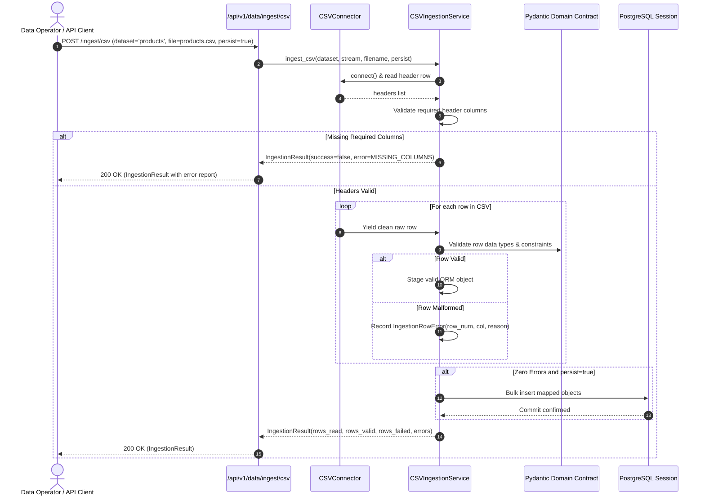

# NEXUS Data Ingestion Architecture & Design

## 1. Design Overview
The NEXUS Ingestion Engine is engineered around a contract-first philosophy:
- Incoming tabular data must conform to predefined entity contracts before touching database tables.
- Ingestion is stateless and sandboxed: no arbitrary Python expressions, regex injections, or shell invocations can be triggered via file payloads.

---

## 2. Ingestion Flow



---

## 3. Extensible Connector Interface (`BaseConnector`)
All current and future connectors implement the standard lifecycle interface:

```python
class BaseConnector(ABC):
    @abstractmethod
    def connect(self) -> None: ...
    @abstractmethod
    def disconnect(self) -> None: ...
    @abstractmethod
    def validate_source(self) -> bool: ...
    @abstractmethod
    def read_records(self, limit: Optional[int] = None) -> Generator[Dict[str, Any], None, None]: ...
```

This guarantees that future connectors for PostgreSQL foreign tables, Amazon S3 Parquet, Snowflake, and Shopify REST APIs can be added as drop-in plugins without altering the ingestion service or validation logic.
