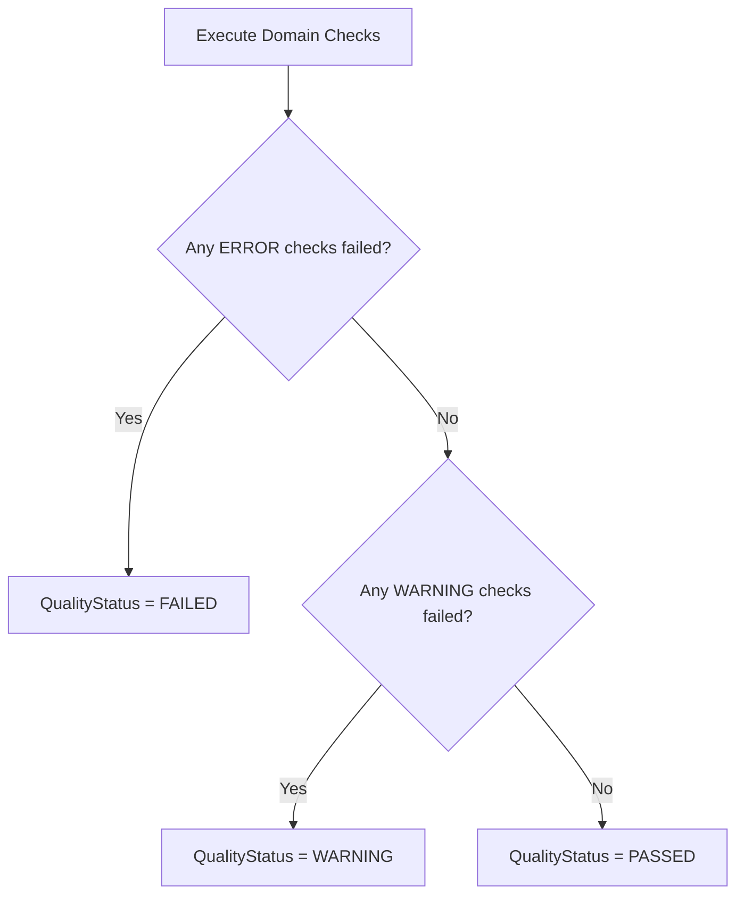

# NEXUS Data Quality Rules Catalog

## 1. Quality Philosophy
Data quality in NEXUS is strictly deterministic. Quality audits produce an actionable scorecard detailing:
1. Which specific rule was evaluated.
2. The severity classification (`INFO`, `WARNING`, `ERROR`).
3. Total affected row counts.
4. Concrete sample identifiers of violating rows.

---

## 2. Rule Specifications

| Rule Identifier | Entity | Target Column(s) | Severity | Definition & Condition |
| :--- | :--- | :--- | :---: | :--- |
| `chk_required_fields_present` | All | Configured mandatory columns | `ERROR` | Column value must not be NULL or empty whitespace. |
| `chk_customer_code_unique` | Customers | `customer_code` | `ERROR` | Distinct count must equal total customer row count. |
| `chk_email_unique` | Customers | `email` | `ERROR` | Email address must be unique across all active profiles. |
| `chk_sku_unique` | Products | `sku` | `ERROR` | Product SKU must be unique across entire catalog. |
| `chk_unit_cost_non_negative` | Products | `unit_cost` | `ERROR` | Landed cost must satisfy $unit\_cost \ge 0.00$. |
| `chk_selling_price_non_negative`| Products | `selling_price` | `ERROR` | Catalog price must satisfy $selling\_price \ge 0.00$. |
| `chk_quantity_positive` | SaleItems | `quantity` | `ERROR` | Ordered units must satisfy $quantity > 0$. |
| `chk_line_total_reconciliation` | SaleItems | `line_total`, `quantity`, `unit_price`, `discount_amount` | `ERROR` | $|line\_total - ((quantity \times unit\_price) - discount)| \le 0.02$. |
| `chk_transaction_number_unique` | Sales | `transaction_number` | `ERROR` | Invoice number must be globally unique. |
| `chk_transaction_total_reconciliation` | Sales | `total_amount`, `subtotal`, `discount_amount`, `tax_amount` | `ERROR` | $|total\_amount - (subtotal - discount + tax)| \le 0.02$. |
| `chk_fk_customer_id_references_id` | Sales | `customer_id` | `ERROR` | Every sale must reference an existing customer ID. |
| `chk_fk_sale_id_references_id` | SaleItems | `sale_id` | `ERROR` | Every line item must reference an existing sale order. |
| `chk_fk_product_id_references_id`| SaleItems | `product_id` | `ERROR` | Every line item must reference an existing product SKU. |
| `chk_inventory_stock_non_negative` | Inventory | `stock_quantity` | `ERROR` | Warehouse stock cannot be negative ($stock \ge 0$). |
| `chk_expense_amount_non_negative`| Expenses | `amount` | `ERROR` | Incurred expenditure must satisfy $amount \ge 0.00$. |

---

## 3. Scorecard Status Determination

