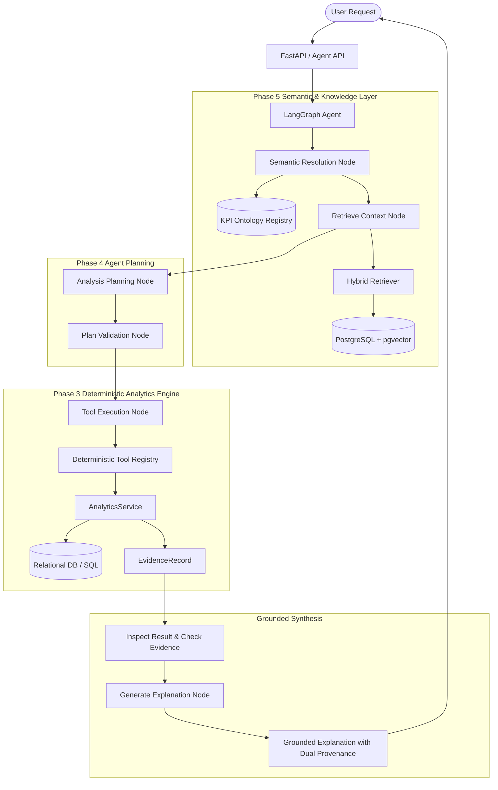

# NEXUS Phase 5 — Business Context RAG + Semantic Layer Architecture

## 1. Core Philosophy

NEXUS is **not a generic document chatbot** or "chat with PDFs" wrapper. In an enterprise Business Intelligence platform, language models must **never become the source of truth for numerical calculations**.

NEXUS establishes strict separation of responsibilities:
- **Semantic Layer**: Resolves business language, terms, and synonyms to canonical metrics.
- **Deterministic Analytics Engine**: Computes exact, reproducible numbers via SQL and Python statistics.
- **Business Context RAG**: Retrieves verified business definitions, policies, and accounting rules.
- **Evidence Layer**: Provides full mathematical and audit provenance for every figure.
- **LangGraph Agent / LLM**: Orchestrates the analysis flow and synthesizes grounded explanations.

## 2. Dual Provenance Architecture

NEXUS distinguishes between two distinct types of evidence:
1. **Analytics Evidence (`EvidenceRecord`)**: Proves *how a number was calculated*, detailing source tables, aggregation formulas, SQL parameters, assumptions, and statistical caveats.
2. **RAG Evidence (`RAGEvidence`)**: Proves *where business context originated*, detailing document IDs, source filenames, section titles, chunk IDs, similarity scores, and retrieval timestamps.

Both evidence models coexist within every `AgentResponse` payload returned to users and API consumers.
