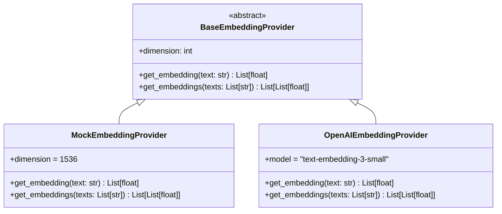

# NEXUS Embedding Provider Abstraction

## 1. Provider Architecture

To ensure vendor independence and guarantee 100% offline, zero-cost CI test execution, NEXUS abstracts vector embeddings behind `BaseEmbeddingProvider`.

## 2. Deterministic Mock Embedding Provider

The `MockEmbeddingProvider`:
1. Tokenizes text into words and subword character trigrams.
2. Uses multi-seed SHA-256 feature hashing to project tokens deterministically into a 1536-dimensional vector space.
3. Applies $L_2$ normalization such that $\|\vec{v}\|_2 = 1.0$.
4. Guarantees:
   - Identical text always yields identical vectors.
   - Text passages sharing business vocabulary exhibit higher cosine similarity than unrelated passages.
   - No internet access, external API keys, or paid tokens are required for CI.

## 3. Production Providers

In production environments, `EMBEDDING_PROVIDER=openai` can be configured along with an `OPENAI_API_KEY`. If the key is not provided, the factory gracefully falls back to `MockEmbeddingProvider` to prevent startup crashes.
