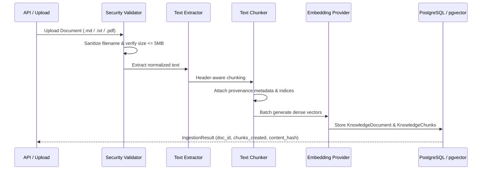

# NEXUS Document Ingestion & Chunking Pipeline

## 1. Supported Document Formats

The NEXUS ingestion pipeline accepts:
- **Markdown (`.md`)**: Processed using header-aware semantic chunking.
- **Plain Text (`.txt`)**: Processed using paragraph boundaries with overlap.
- **PDF (`.pdf`)**: Extracted via `pypdf`, page-labeled, and chunked.

## 2. Ingestion Workflow

## 3. Header-Aware Chunking

Markdown documents are split by structural headers (`#`, `##`, `###`), preserving the semantic section title on every chunk. Large sections exceeding the configured window (`chunk_size=800` characters) are partitioned with an overlap (`chunk_overlap=100` characters) to maintain continuity across boundary sentences.

## 4. Content Hash Deduplication

Before generating embeddings or inserting records, the ingestion service computes the SHA-256 hash of the normalized content. If an identical document already exists in an active state, the service returns the existing document record without re-embedding, saving compute and storage.
